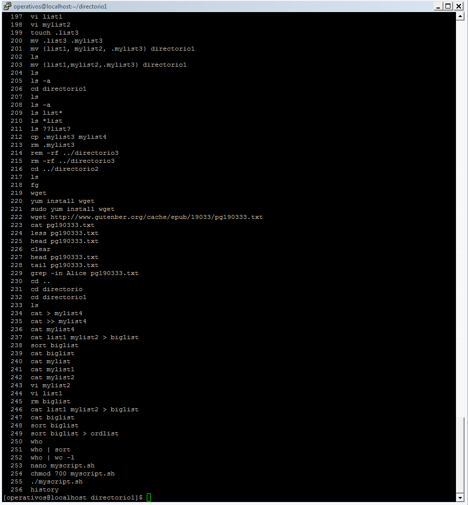
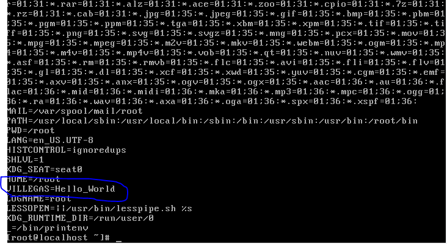
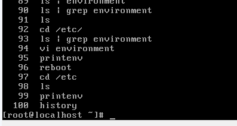

# Informe comandos CentOs

Nombre: Andrés Villegas  
Código: A00239629  

## Captura History

El documento completo se encuntras en history_villegas.txt
-------------

## Solución a las preguntas

1-
+ /bin: El directorio bin almacena los ejecutables que deben estar disponibles para todos los usuarios,
por ejemplo: cat, ls, cp, etc. Ademas de este directorio, cada usuario tiene su propia carpeta bin local
en donde se guardan los ejecutables especificos para ese usuario.

+ /dev: Este directorio contiene archivos especiales para todos los dispositivos del sistema. entre estos
archivos se encuentran drivers. Un archivo especial dentro de este directorio es el dev/null el cual
actua como un hoyo negro donde todo lo que sea enviado alli jamas podra ser recuperado

+ /etc: Este directorio contiene variedad de archivos que son de gran importancia para el sistema
operativo. Entre otros se encuentran: passwd, shadow (Los cuales almacenan información de usuario
y los hash de las contraseñas respectivamente), rc, group, magic, etc.

+ /mnt: Este directorio se encarga de dar acceso (o ser un punto de montaje) a travez del filesystem
a dispositivos de almacenamiento externos o temporales. Aunque no es estricatamente necesario,
algunas veces, ciertas particiones del dico son monstadas en este directorio.

+ /sbin: Este directorio es muy similar al directorio /bin, ya que contiene ejecutables que son cargados
al inicio del sistema, sin embargo, los ejecutables presentes en /sbin estan solo disponibles para
el usuario root y son considerados herramientas administrativas. Estos ejecutables tampoco se cargan
en el PATH de los usuarios comunes, solo el root.

2-
printenv es parte de laa GNU coreutils. esta utilidad cuando es usada sin argumentos imprime los nombres
de las variables de entorno y su valor de la manera NAME = value. Esta utilidad recibe como argumento
el nombre de alguna variable de entorno e imprime su valor. Si la variable no existe no imprime nada

3-
Para crear variables de entorno permanetes es necesario agregar el comando export VAR=val (donde VAR es el
nombre de la variable que queremos crear y val es el valor que queremos asiganrle), en alguno de los archivos
de script que se ejcutan al inicio. Si queremos una variable para todos los usuarios sera necesario poner el
comando en el archivo /etc/profile. En caso de que solo sea para un usuario se podrian usar los siguientes archivos
~/.bash_profile, ~/.bash_login o ~/.profile. En algunas verisiones de linux existe un archivo llamado /etc/environment
en caso de que exista el comando debe ser puesto alli.

En esta imagen se puede observar la salida del comando **printenv**

Para verificar que esta variable se agrego de forma permanente se hizo un reboot del sistema y se ejecuto el comando **printenv** de nuevo

4-
Para instalar una aplicación desde su código fuente es necesario seguir una serie de pasos  
  1. descarar el archivo comprimido que contiene el codigo fuente del programa que queremos instalar
  usualmente esto se logra a travez del aplicativo wget <url.de.descarga>  
  2. descomprimir el comprimido usualmente los formatos de compresión para estos caso son 'tar.gz' o 'tar.bz2'
  para el primero se debe usar el comando tar -xvfz para descomprimir. El segundo se descomprime con tar -xvfj  
  3. una vez descomprimido se debe buscar los archivos README o INSTALL. En los cuales se encontrara la documentación
  de la instalación. En este se puede especficar prerequisitos, versiones, etc.  
  4. se debe ejecutar el archivo de configuración. Casi siempre corresponde al archivo configure. Es recomendable
  usar configure --help para coonocer las opciones de ejecución del archivo. Despues de la ejecución del configure
  se abra creado el archivo makefile  
  5. ejecutar el comando make para compilar el codigo fuente  
  6. ejecutar make install para instalar y mover la aplicación a los directorios apropiados para su funcionamiento  
  7. Pruebe y utilize la aplicación que acabo de instalar.  

En mi caso, instale el programa **sl** el cual es una utilidad poco util que imprimi una locomotora de vapor cuando se escribe mal el comndo
**ls**

  
    

Referencias
http://askubuntu.com/questions/571617/what-is-the-purpose-of-the-bin-directory
http://www.tldp.org/
http://www.linfo.org/mnt.html
http://www.linfo.org/sbin.html
http://www.thegeekstuff.com/2012/06/install-from-source
